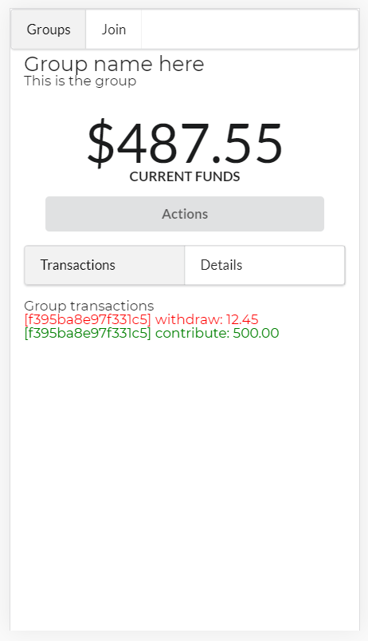
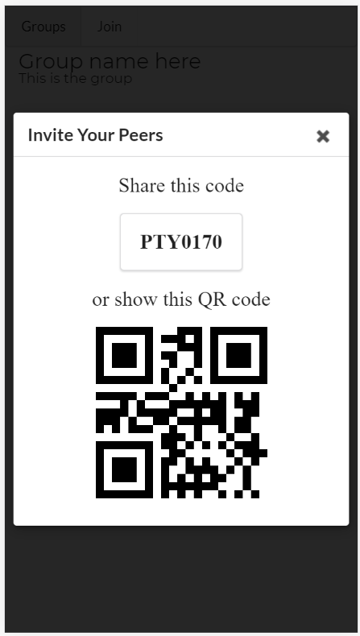
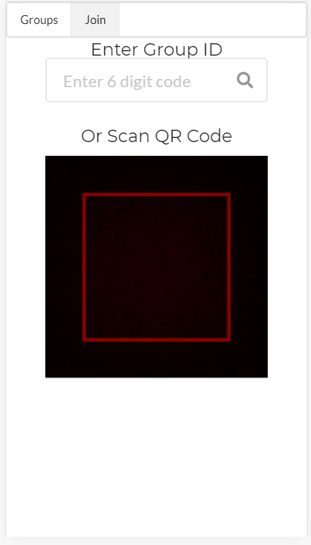
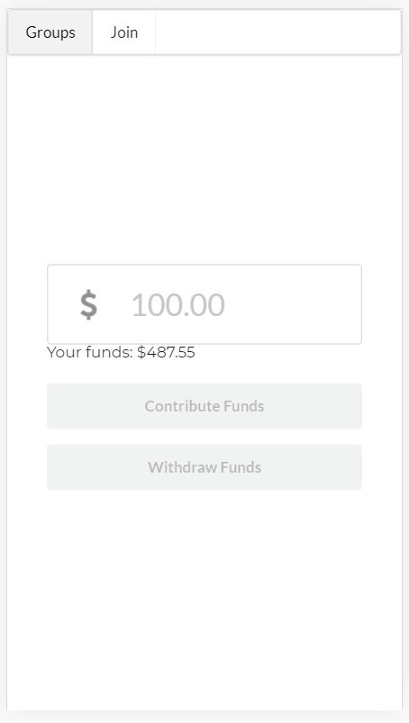
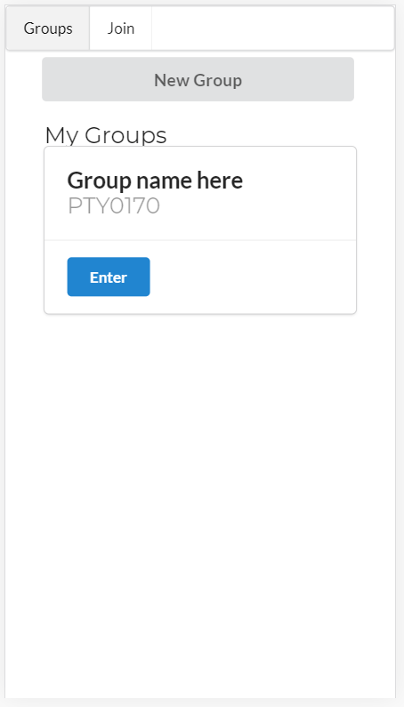

# kitty-hackathon
## Social Budgeting

This project was built from December 3, 2019 to December 5, 2019 as part of the [Finastra Hack To The Future Hackathon](https://fintech.devpost.com/). Our team participated in the on-site Hackathon held at their Mississauga, Ontario office.

This project utilizes Finastra's [FusionFabric Platform](https://www.finastra.com/platform) to dynamically create new bank accounts.

The purpose of this project is to allow individuals to create a joint bank-account with their peers in order to pool money into a savings account.

### Demo
https://sls19.ca/

### Technologies
* React
* Node.js
* Express
* MongoDB
* Axios
* SocketIO
* Semantic UI
* [qrcode.React](https://github.com/zpao/qrcode.react)
* [react-qr-reader](https://github.com/JodusNodus/react-qr-reader)

### Screenshots

*Group Dashboard*

*Invite peers to your group*

*Join a group*

*Contribute funds to group*

*List of groups you are a part of*

